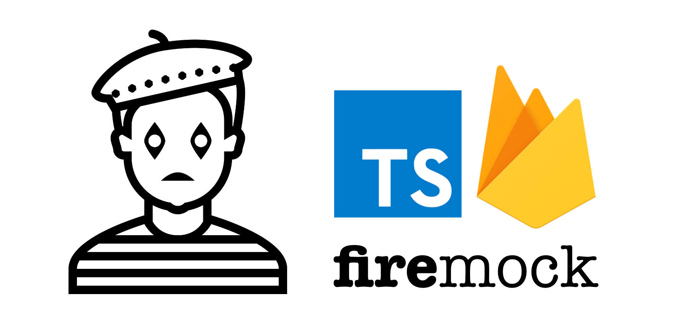

[](https://travis-ci.org/forest-fire/firemock.svg?branch=master) [](https://opensource.org/licenses/MIT)



# firemock
> Firebase, Typescript, and mocking ... what more could you ask for?

## Overview

This Typescript library is meant to serve as a type-aware solution for node developers using a Firebase backend. The functional overview consists of:

1. Generate mock data -- with Firebase conventions -- for testing
2. Provide an in-memory database/data structure to store this mock data for testing durations
3. Provide a Firebase [API surface](https://firebase.google.com/docs/reference/js/firebase.database.Reference) for querying the in-memory database

It's worth pointing out that this library _does not_ do the typical mock/spy types of tracking that you get with frameworks like _sinon_ or _test-double_ in JS and/or _ts-mokito_ or _typemoq_ in TS. If that's what you want then use one of these already existing solutions.
## Installation

To start using, simply type one of the following into your terminal window at the root of the project:

```sh
# npm
npm install --save-dev firemock
# yarn
yarn add --dev firemock
```

## Documentation

The documentation is hosted on Gitbook, point your browser to: [firemock documentation](https://www.firemock.com/)

## Contribution: PRs and Issues

I have developed this for my own needs but as with all my other open-source work I'd be happy to recieve PR's and issues. Not surprisingly, PR's are my preference but sometimes people don't feel they have the right skills or time to fix something they feel is broken so raising issues is a nice way to communicate something you've noticed. I can't promise issues will always get immediate attention but I will get back as soon as I can. 

## License

Copyright (c) 2017 LifeGadget Ltd

Permission is hereby granted, free of charge, to any person obtaining a copy of
this software and associated documentation files (the "Software"), to deal in
the Software without restriction, including without limitation the rights to
use, copy, modify, merge, publish, distribute, sublicense, and/or sell copies
of the Software, and to permit persons to whom the Software is furnished to do
so, subject to the following conditions:

The above copyright notice and this permission notice shall be included in all
copies or substantial portions of the Software.

THE SOFTWARE IS PROVIDED "AS IS", WITHOUT WARRANTY OF ANY KIND, EXPRESS OR
IMPLIED, INCLUDING BUT NOT LIMITED TO THE WARRANTIES OF MERCHANTABILITY,
FITNESS FOR A PARTICULAR PURPOSE AND NONINFRINGEMENT. IN NO EVENT SHALL THE
AUTHORS OR COPYRIGHT HOLDERS BE LIABLE FOR ANY CLAIM, DAMAGES OR OTHER
LIABILITY, WHETHER IN AN ACTION OF CONTRACT, TORT OR OTHERWISE, ARISING FROM,
OUT OF OR IN CONNECTION WITH THE SOFTWARE OR THE USE OR OTHER DEALINGS IN THE
SOFTWARE.
